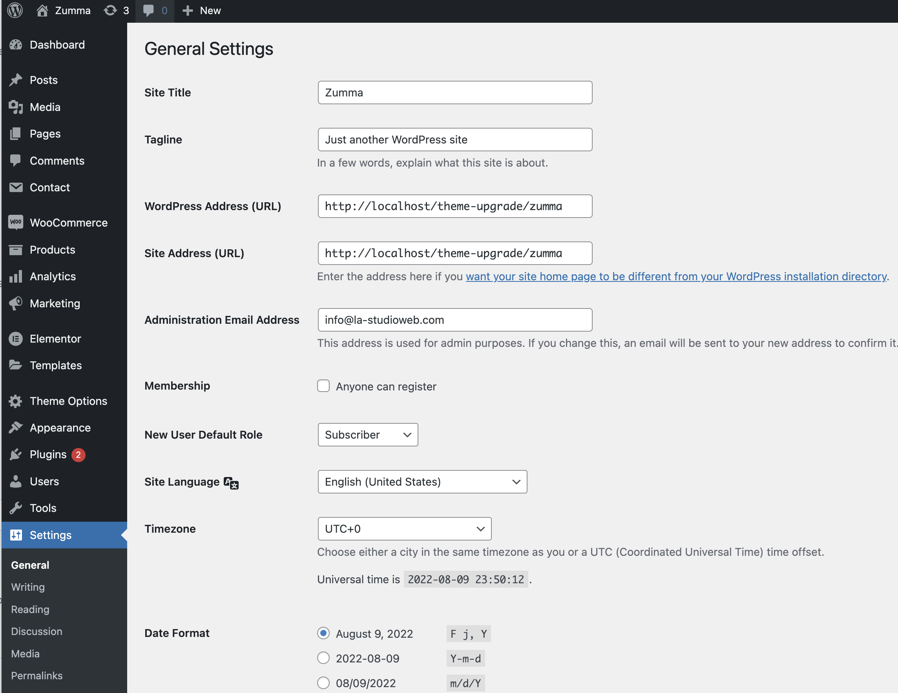
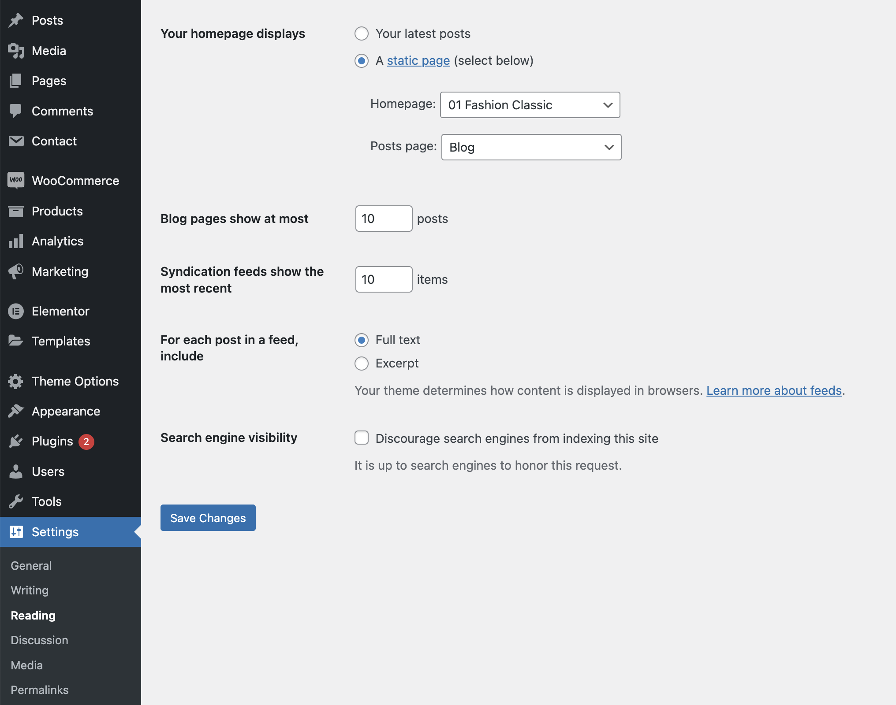

# WordPress configuration


### Where you can change your site's name, time settings &#x20;


Go to **Settings > General,** you'll be able to change&#x20;

* Site address&#x20;
* Tagline&#x20;
* Admin email address&#x20;
* Allow/Disable people register
* Timezone&#x20;
* Site language&#x20;
* Date & time format&#x20;


### Where to set your homepage&#x20;


Go to Settings > Reading&#x20;

* You'll be able to set the homepage in **Homepage** box, Post page in the **Post page** box &#x20;
* Set number of blogs per page&#x20;
* Set number of most recent items&#x20;
* Choose show excerpt or full text for post&#x20;

