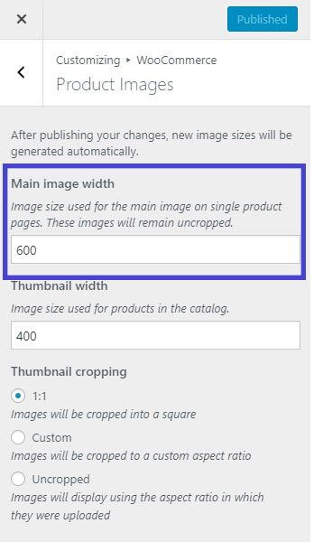
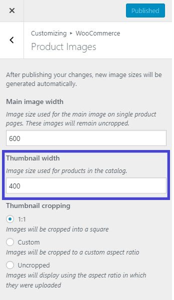
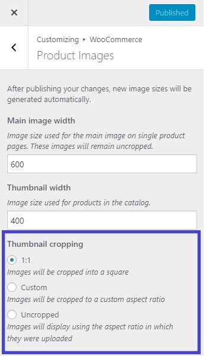

# How To Change WooCommerce Product Image Size

[WooCommerce](https://woocommerce.com/) [3.3](https://woocommerce.wordpress.com/2017/12/11/wc-3-3-image-size-improvements/) introduced a new and easier way to resize the product images. You can now change the WooCommerce Product Image Size from _**Appearance > Customize > WooCommerce > Product Images**_. And the great things is you don’t have to regenerate the images after resizing them. From WooCommerce 3.3 you can now crop, resize and automatically regenerate images all from the _**Appearance > Customize > WooCommerce > Product Images**_.

**TLDR:**\
Product Image settings are moved from _WooCommerce > Settings > Products > Display_ to _Appearance > Customize > WooCommerce > Product Images_.

### Resizing Single Product Image

Follow these steps to change single product image size:

1. Go to _**Appearance > Customize**_
2. Then go to _**WooCommerce > Product Images**_
3. Write your desired width in “_**Main image width**_” field.
4. Click on “_**Publish**_”




**Note**: Height of single or main product images will remain uncropped and not affected by the cropping settings.


One of the cool features introduced in WooCommerce 3.3 is automatic thumbnail resizing. Meaning after setting the width all of your product images will be automatically resized and regenerated in the background. Previously we had to install “Regenerate Thumbnails” plugin to regenerate the images to new resolution.

### Resizing Product Thumbnail Image

Follow these steps to change shop, catalog or product category image size:

1. Go to _**Appearance > Customize**_
2. Then go to _**WooCommerce > Product Images**_
3. Write your desired width in “_**Thumbnail width**_” field.
4. You can set the height of the images in “_**Thumbnail Cropping**_”
5. Click on “_**Publish**_”



### Height of Shop Product Images

Setting the Height of the Shop or Catalog Images:

#### Thumbnail Cropping

* &#x20;**1:1**: If you select 1:1, your images will be cropped into 360px width and 360px Height (assuming you have set the image width 360px in Thumbnail Width field.
* **Custom**: In Custom you can select the aspect ratio of the image. Here is some of the popular aspect ratio (1:1, 5:4, 4:3, 3:2, 16:9 and 3:1).
* **Uncropped**: Height of the image will be untouched. Images will display using the aspect ratio in which they were uploaded.



### Frequently Asked Questions:

#### **Missing Main Image Width and Thumbnail Width Fields**

One of the common issue after updating to WooCommerce 3.3 is, after updating store owners say that “I can’t seem to find the Main Image Width and Thumbnail Width Fields in my Appearance > Customize > WooCommerce > Product Images.” The reason behind this is, your theme has declared WooCommerce support and defined those settings in themes functions.php. If it’s predefined then they are removed from the customizer. So basically, If your theme declares image size in theme support, image width settings are not available.

#### **How can I change it if it’s set by Theme Developer**

You have to remove or change the image width settings from your themes functions.php file. For example, In Storefront, you will not find any Main Image or Thumbnail field settings. Because they declared that beforehand in [storefront/inc/class-storefront.php](https://github.com/woocommerce/storefront/blob/9333eb7da77320553762a768f88265bb943b2fc5/inc/class-storefront.php#L117)

```php
// Declare WooCommerce support.
 add_theme_support( 'woocommerce', apply_filters( 'storefront_woocommerce_args', array(
   'single_image_width'    => 416,
   'thumbnail_image_width' => 324,
   'product_grid'          => array(
   'default_columns' => 3,
   'default_rows'    => 4,
   'min_columns'     => 1,
   'max_columns'     => 6,
   'min_rows'        => 1
 )
) ) );
```

Single Product Image has been set to 416px wide and thumbnail to 324px wide. In that case, you can either remove these two lines or change the width number to your desired width. But make the change after creating a child theme; otherwise, it will revert back to previous settings if you update the theme.

#### **How Do I Set Catalog Image Sizes?**

From WooCommerce 3.3, both Shop product images and catalog or category images are resized based on the settings from _**Appearance > Customize > WooCommerce > Product Images > Thumbnail Width**_ field.
