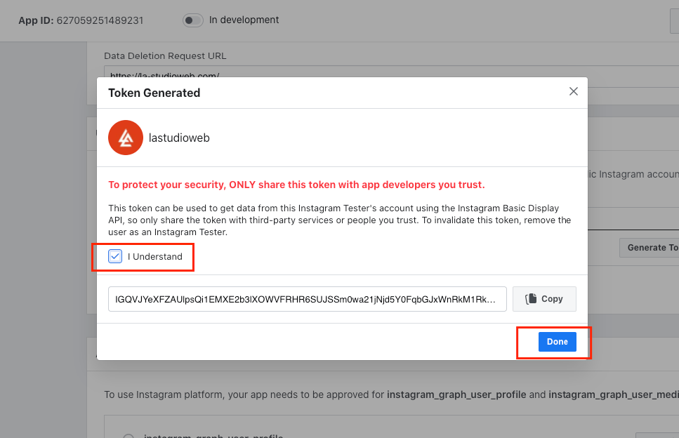

# How to get Instagram Access Token

Starting from **March 2020**, Facebook requires users to create a Facebook app with Instagram Basic Display API to get a long-live Instagram Access Token. Follow our instructions on this section to get your own Instagram Access Token and paste it back on the **Appearance -> Theme Options -> Additional Code -> Instagram Token**

**You will need:**

* A Facebook account.
* An Instagram account with media.

### **Step 1: Create a new App**

\
Go to [developers.facebook.com](https://developers.facebook.com/), click **My Apps**, and create a new app.

Once you have created the app and are in the App Dashboard, navigate to **Settings** > **Basic**, scroll the bottom of the page, and click **Add Platform**.

Choose **Website**, add your website’s URL, and save your changes.

### **Step 2: Configure Instagram Basic Display**

Click **Products**, locate the **Instagram Basic Display** product, and click **Set Up** to add it to your app.

Click **Basic Display**, scroll to the bottom of the page, then click **Create New App**.

In the form that appears, complete each section using the guidelines below.\
_**Display Name**_\
Enter the name of the Facebook app you just created.

_**Valid OAuth Redirect URIs**_

Enter your website’s URL.

For example: [https://la-studioweb.com/](https://la-studioweb.com/)

After you enter a URL, save your changes and check the URL again; Instagram may have appended a trailing forward slash depending on your URL structure.

_**Deauthorize Callback URL**_

Enter your website’s URL again.

_**Data Deletion Request Callback URL**_

Enter your website’s URL once again.

_**App Review**_

Skip this section for now since you will not be switching the app to **Live Mode** during the tutorial.

Save your changes before heading to the next step.

### **Step 3: Add an Instagram Test User**

Navigate to **Roles** > **Roles** and scroll down to the Instagram Testers section. Click **Add Instagram Testers** and enter your Instagram account’s username and send the invitation.

Open a new web browser and go to [www.instagram.com](https://l.facebook.com/l.php?u=https%3A%2F%2Fwww.instagram.com%2F\&h=AT3IpFSLdh5MMecvubFoSiffDnOhipinduFlVQEukLk8fH553\_YldBY9hlCWjLXyqVPYOBc6r4J7QjpF-q9Ys1RUW64vHJQlFdq8WjVDluEBjJf-rh-qsD1QNxXUiZuthm82NTKAIZjyCFL24-lQHw) and sign in to your Instagram account that you just invited. Navigate to **(Profile Icon)** > Click on the **cogwheel icon next to “Edit Profile” button** > **Apps and Websites** > **Tester Invites** and accept the invitation.

Your Instagram account is now eligible to be accessed by your Facebook app while it is in **Development Mode**.

### **Step 4: Generate Access Token for Test User**

Navigate to **App Dashboard** > **Products** > **Instagram** > **Basic Display** page and scroll down to **User Token Generator** section. Click on “**Generate Token**” button.

Log in with your Instagram account. Allow the app to access your Instagram account data.

Click on “I understand” checkbox then copy your Instagram Access Token.

Paste your Instagram Access Token on **Theme Options -> Integrations -> Instagram Token**


**Note:** Long-lived tokens are valid for 60 days and our app will refresh your token automatically before they expiring. You will not have to manually regenerate your access token.

