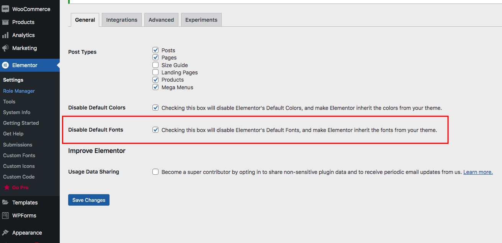
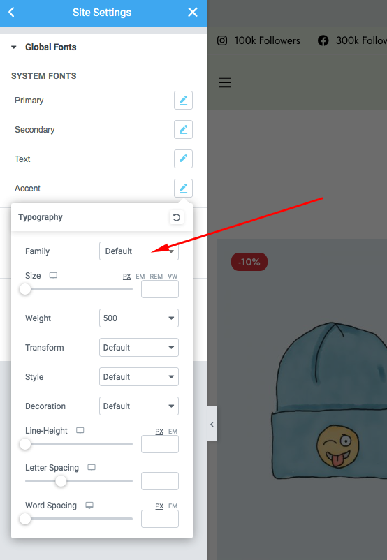
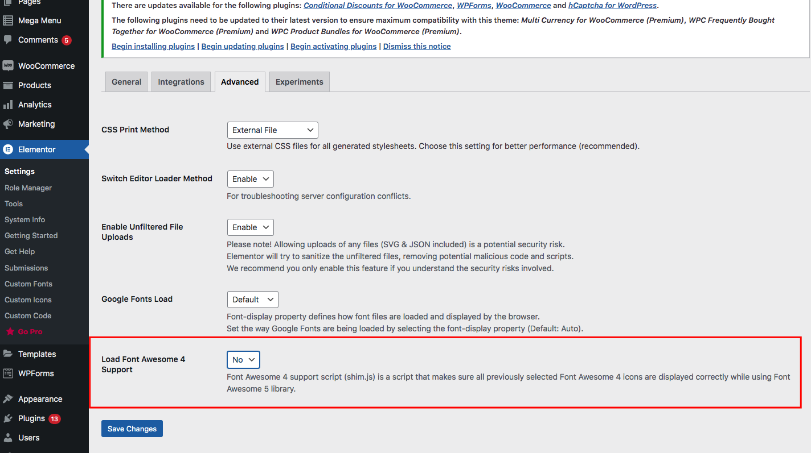
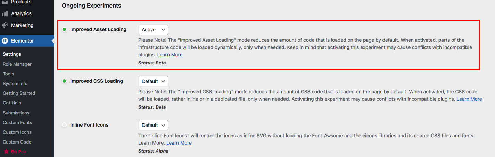

# Optimize theme

**. Disable Gutenberg assets:** Usually you can use gutenberg blocks on blog and post pages. So disable them in rest pages to improvement page loading.

* Open functions.php in your-site/wp-content/themes/zumma-child
* Then add this following code:

```css
function zumma_child_disable_gutenberg_wp_enqueue_scripts() {
  if( ! is_singular('post') ) {
     wp_dequeue_style('wp-block-library');
     wp_dequeue_style('wp-block-library-theme');
     wp_dequeue_style('wc-blocks-style');
  }
}
add_action('wp_enqueue_scripts', 'zumma_child_disable_gutenberg_wp_enqueue_scripts', 100);
```

**3. Disable WordPress global style:** [https://github.com/WordPress/gutenberg/issues/36834](https://github.com/WordPress/gutenberg/issues/36834)

* Open functions.php in your-site/wp-content/themes/zumma-child
* Then add this following code:

```css
function zumma_child_remove_wp_global_styles() {
     remove_action( 'wp_enqueue_scripts', 'wp_enqueue_global_styles' );
     remove_action( 'wp_body_open', 'wp_global_styles_render_svg_filters' );
}
add_action( 'init', 'zumma_child_remove_wp_global_styles' );
```

### Config Elementor settings to get best performance

#### 1. Disable default font:&#x20;

Avoid duplicate fonts load by Elementor and Zumma

1. Go to Elementor -> Settings -> General -> Tick on Disable Default Fonts box.



2\. Edit any page with Elementor -> Site Settings (Click on Bars icon) -> Global Fonts -> System Fonts => Choose font family as ‘Default’ for all settings: Primary, Secondary, Text, Accent



#### 2. Disable Font Awesome 4 Support&#x20;

New websites don’t need support old Font Awesome version. So choose ‘No’ to disable it then reduce some assets loading for your website.



#### 3. Enable Improved Asset Loading&#x20;

The “Improved Asset Loading” mode reduces the amount of code that is loaded on the page by default



### How to choose best server for Zumma theme?

**1. Hosting**

We recommended use Nginx hosting.

**2. CDN service**

We high recommended use BunnyCDN service ([https://bunny.net/](https://bunny.net/?ref=9x6igr10de))

**3. Caching**

We recommended use combine these plugins:

Redis Cache: [https://wordpress.org/plugins/wp-redis/](https://wordpress.org/plugins/wp-redis/)

Nginx Helper: [https://wordpress.org/plugins/nginx-helper/](https://wordpress.org/plugins/nginx-helper/)

Autoptimize: [https://wordpress.org/plugins/autoptimize/](https://wordpress.org/plugins/autoptimize/)

WP-Rocket: [https://wp-rocket.me/?ref=9ed66b6f](https://wp-rocket.me/?ref=9ed66b6f)
