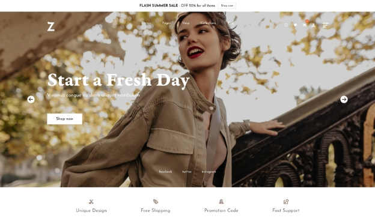

# How to install demo


**Good to know:** Zumma allows you to install any demo you want with just one single click





**Summarize**&#x20;

* Upload zip file in **Appearance > Themes**&#x20;
* Install required plugins &#x20;
* Go to **Tools -> Demo Import** to Install demos


### **Step 1: Upload zip file**&#x20;

* Download zip file from ThemeForest: Go to **Downloads tag > Download > Installable WordPress file only** &#x20;


If you choose **All files & documentation**, don't forget to unzip the file before going to the next step.&#x20;


* Go to **Admin > Appearance > Themes**&#x20;

* Upload zip file > Install Now&#x20;
* It's done, then hit **Activate**&#x20;
* Activate ZUMMA theme now

### Step 2: Install required plugins&#x20;

* Here is the list of required and recommended plugins:

* Go to **Appearance -> Install Plugins** in Dashboard and install all required plugins&#x20;

### Step 3: Import demos&#x20;

* Go to Tools -> Demo Importer
* Then select the demo which you want import and click to button "Import Demo"

* The progressing would be displayed on import status bars so you will know when it is finished and your data is ready.

This process will take about some minutes

**DONE. Now, you can visit your website to view demo.**

