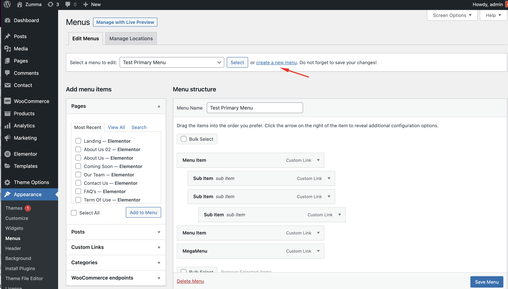

# How to create menu

**Step 1**: Navigate to **Apperance** > **Menus** in your admin sidebar and click **Create a new menu** option.

**Step 2**: Give your menu a name, then hit **Create Menu**.

**Step 3**: Choose menu items you want to add from the left and hit **Add to Menu**.

Then hit **Save Menu**

Your new menu has been created:

### How to edit menu&#x20;

**Step 1**: Go to **Appearance** > **Menus** on admin sidebar, select a menu to edit.

**Step 2**: Rename menu name as you wish. If you want to add more menu items, choose them from the left and hit **Add to menu**.

With each menu item, you can rename or drag to make it sub-menu.

Remember to hit **Save Menu** when you finish editing.
