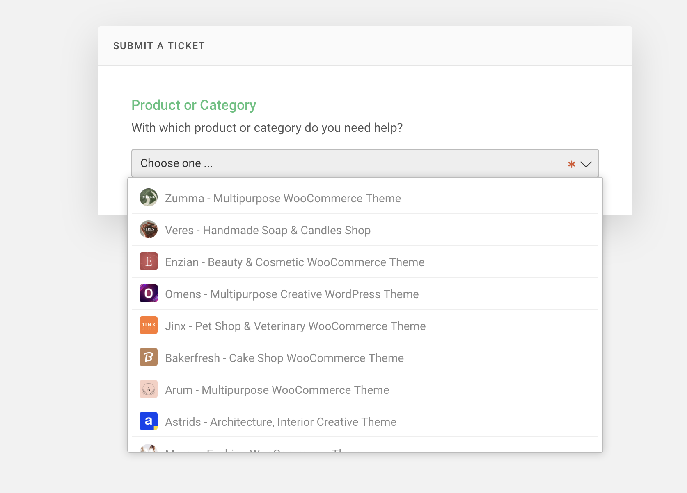
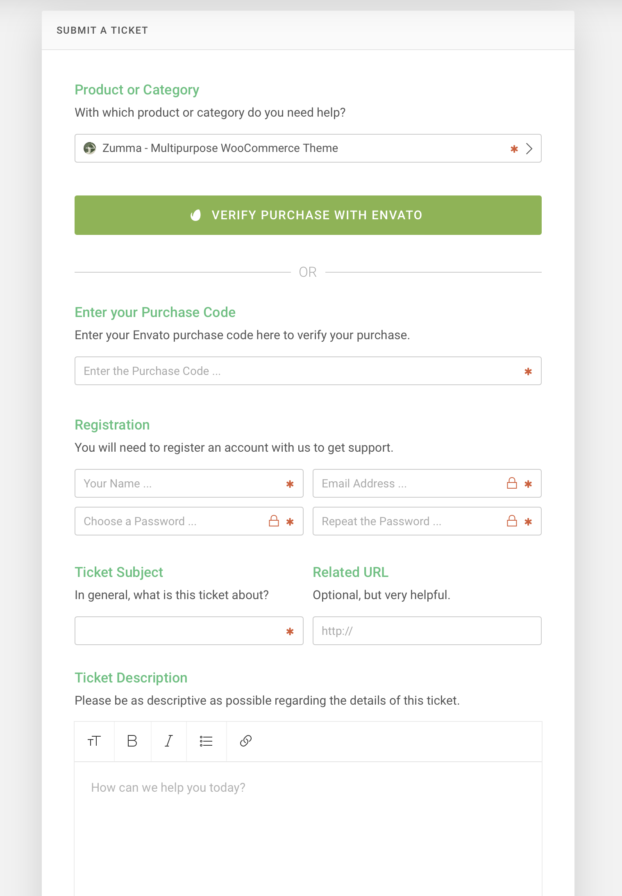

# How to get support


Each comes with **6 months of support** and free lifetime updates for your Theme.


Once the 6 months support is up, you have the opportunity to extend support coverage up to 6 or 12 months further.\

* If you choose to not extend your support, you will still be able to submit bug reports via email or item comments and still have access to our **online documentation** knowledge base and **video tutorials.**
* Envato clarifies item support policy [here](https://themeforest.net/page/item\_support\_policy).
* We have an advanced, secure [ticket system ](https://https/support.la-studioweb.com/)to handle your requests. Support is limited to questions regarding the **theme’s features** or issues that are **related to the theme.**
* We are not able to provide support for **code customizations or third-party plugins.**


If you need help with anything other than minor customization of your theme, we suggest enlisting the help of a developer/freelancer&#x20;


## How To Start Receiving Support 

****

**Option 1: Use Envato account**&#x20;

* Go to [LA-Studio support ](https://support.la-studioweb.com/)
* Hit **Sign in** > Choose **Login with Envato**&#x20;

**Option 2**: Use purchase code&#x20;

* Go to [LA-Studio support ](https://support.la-studioweb.com/)
* Hit **Submit a Ticket**&#x20;
* Choose the theme that you are using

* Take [the purchase code](https://app.gitbook.com/s/CGEvkIGZQql1dvbXwu25/\~/changes/DvTNWPEBFkH9k7PROzD1/guides/my-purchase-code) and then fill the form - you also can **verify purchase with Envato**&#x20;

**Then,**  write your request/question as detailed as possible. If you need help at installing, we'll do it for free for you (no extra fee at all), and you should provide your WordPress's admin credentials for faster support.&#x20;


**Creating a ticket is the faster & more convenient way. Please patiently wait till your ticket has proceeded**. In case you'd add a new comment before we have a chance to respond, your ticket will go down the list, so, you must edit your previous comment instead.


_If you cannot log in, you can send an email to info@la-studioweb.com and provide your purchase code, our team will check to help you. However, we **don't recommend** this way. The response will be **slower** because we need to forward it to our support team, then it takes double the total time._

****
