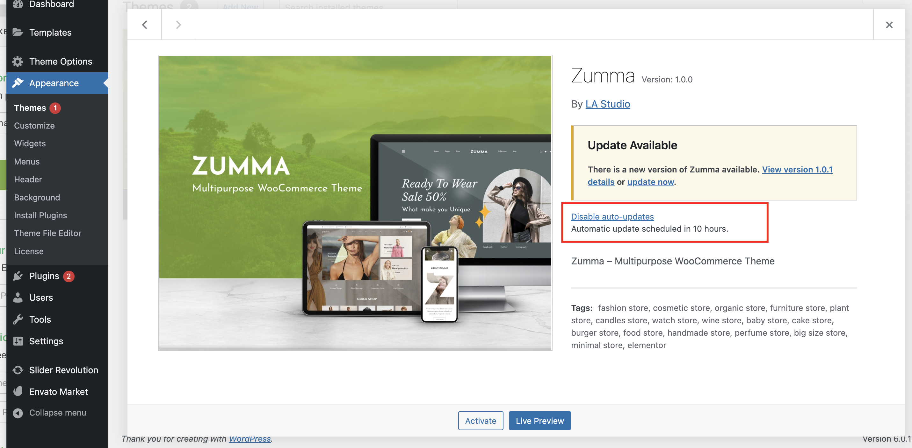
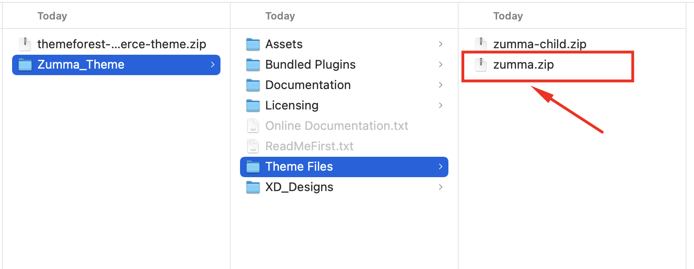
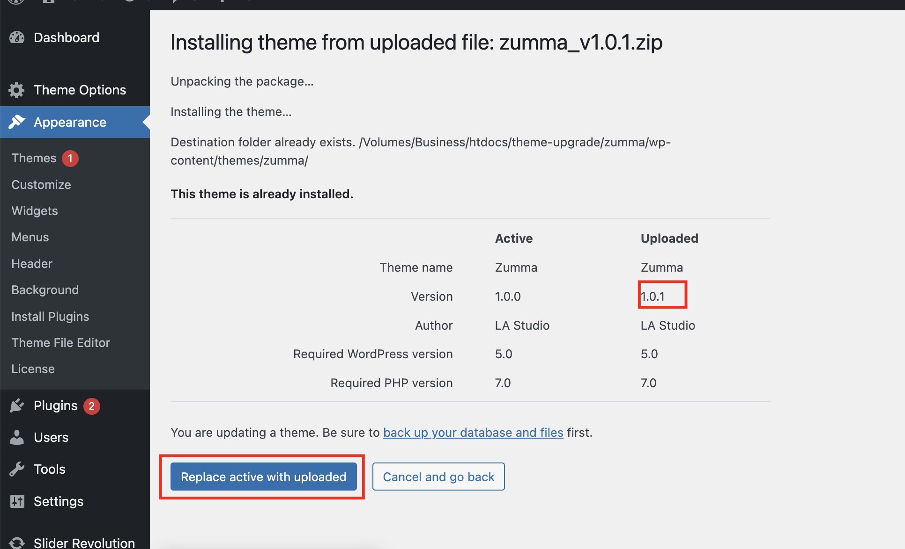

# Update Theme


Check [this article ](../faqs/things-you-should-know-about-theme-updating.md)before updating ZUMMA


There are 2 ways to update Zumma:&#x20;

* Update Automatically (Recommended): Using **LA-Studio Updater** plugin&#x20;
* Update Manually: Upload to **Admin dashboard** or **FTP**&#x20;

### **#1 Update automatically**&#x20;

* Navigate to **Appearance** >> **License**
* Fill in your **Purchase code** and submit it. Then, you will be informed when there is an available update. Click the button **Save Changes.**

* Then go to **Appearance -> Theme** and click to **Enable auto-updates** , then the theme will be automatically updated.

 

### **#2 Update manually** &#x20;

**Step 1:** Download the theme package from ThemeForest and get the file _**zumma.zip**_&#x20;

**Step 2:** Upload file:&#x20;

* If you use FTP, you just have to Log in to FTP, then Update file _**zumma.zip**_ into folder **var/www/htdocs/wp-content/themes**
* If you use the **Admin dashboard,** follow these steps to update ZUMMA to the new version


Step:

1. From Admin Dashboard, go to **Appearance > Themes > Add New > Upload Theme**
2. Choose to upload _**zumma.zip**_, then click Install Now
3. Hit **Replace active with uploaded** and it's done.


 
