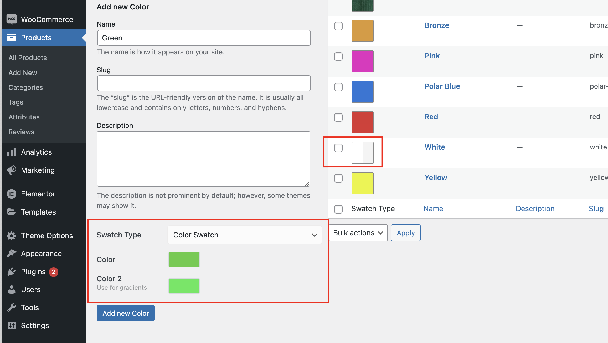
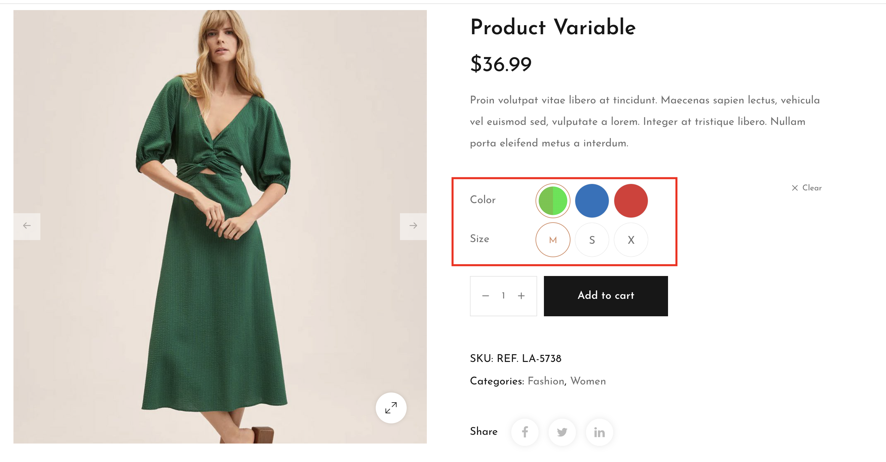

# Color Swatches

_Follow these steps to create Product Variation Swatches._



### Create variations

**Step 1:** From the Dashboard, navigate to **Products > Attributes**&#x20;

**Step 2:** Fill in the Attribute name (such as Size, Color, Image, etc)

_For example, you want to add color attribute to the product then fill in “Color” in “Name” field._

**Step 3:** You can determines how this attribute's values are displayed with **Swatch Type**

You can display your attribute in 2 types:

1. _Image_

 

2\. Color / Gradient Color

When you're done, you can choose to create new product using this attribute**,** or add this attribute to the products you've already create.


To change how your variation display, from Attributes, click Edit the Attribute you've just created > Swatch Type > Update&#x20;


### Set up variation swatches for product**s**

**Step 1:** From the admin dashboard, navigate to **Products > All Products**.


Note: If you haven't created any product, go to Product > Add New, then fill in all the need information


**Step 2:** Select the product you want to set Product variation swatches. At the Product data section, select Product type as Variable product.\
**Step 3:** Choose tab Attributes > Add the attribute you've just created

**Step 4:** Click on each attribute tab to fill in its value by typing in the value you want then hit Add new. Also, put a tick on 2 options that are Visible on the product page and Used for variations. And finally hit Save attributes.

**Step 5:** Move to tab Variations, click the dropdown menu and choose Create variations from all attributes, click Go.

****

**Step 6:** Now you will see all the variations appear based on the product’s attributes. Firstly, select the default variation if you want. Next, select the attribute that you want to show on shop catalog.\
**Step 7:** Click on each variation to set up its image, price, sale countdown, and other details as you want.


Notes: In order to display the product variation image when customers select the attribute then you need to add all the variations’ images to Product gallery.


**Step 8:** Finally, click Save changes after you finished all of them. And click Update to save changes to the product.


**Warning**: If you change the attribute name and/or slug you permanently lose the swatches configuration.


Moreover, you can override the swatch type for each product variable

1\. **Create a variable product**. Make sure that you select a global attribute or create a custom one in the “Attributes” tab. Also set up the “Variations” tab. More information about that can be found here:

2\. **Publish** your product.

3\. **Go to** the Swatches tab.

4\. **Select a “Type”** for each of the attributes used for the variations.

* **None.** The options will be offered in a dropdown.
* **Taxonomy Colors and Images.** The options of the global attribute will be offered. (Only available for global attributes.)
* **Custom Colors and Images.** You will be able to add colors and image swatches.
* **Radio Buttons.** The available options will be displayed as radio buttons.

5\. **Choose whether to add a label or not** and where to add it, if you’ve selected “Taxonomy Colors and Images” or “Custom Colors and Images”. This label will display the name of the selected term.

6\. **Select the size of the swatches** if you’ve selected “Custom Colors and Images”. This will determine how large the swatches will be on the product page.

7\. **Configure the attribute terms.** This is similar to how global attribute terms are configured (see above).

* **Select** the term.
* **Choose** Attribute Color or Image.
* If you’ve chosen color, **select a color**.
* If you’ve chosen image, **upload an image**.

8\. **Update** the product.

## How do I change the size of the image swatches? 

You can change the size in **Theme Options > Swatches**

[\
](https://woocommerce.com/wp-content/uploads/2012/06/Screen-Shot-2014-04-23-at-10.09.36.png)
